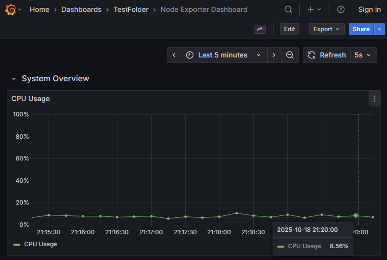

# Demo Alerting in Prometheus and Grafana

This project is based on the [Grafana demo-prometheus-and-grafana-alerts](https://github.com/grafana/demo-prometheus-and-grafana-alerts) repository and was developed as part of the JetBrains internship project: [Monitoring as code for YouTrack](https://internship.jetbrains.com/projects/1664).

## Run the demo environment

To run the demo environment:

```bash
docker compose up -d
```

## Live Demo

This project is temporarily hosted on a 2vCPU 4GB RAM Hetzner VM. You can access the Grafana dashboard at: [http://91.98.203.183/d/node-exporter-dashboard/node-exporter-dashboard](http://91.98.203.183/d/node-exporter-dashboard/node-exporter-dashboard)



## Project Enhancements

This enhanced version includes the following additions:

- **Added Node Exporter** to collect node metrics
- **Updated Prometheus rules** - Added `5.node.yml` to express `cpu_usage` in the format expected for the assignment
- **Created Grafana Dashboard Generator** - A Java project in `grafana/dashboards/generators` that utilizes the Grafana Foundation SDK to generate dashboards and output JSON to the `grafana/dashboards/definitions` folder

The dashboard generator demonstrates the observability-as-code approach using the new Grafana Foundation SDK, allowing for programmatic dashboard creation with proper type safety and maintainability.